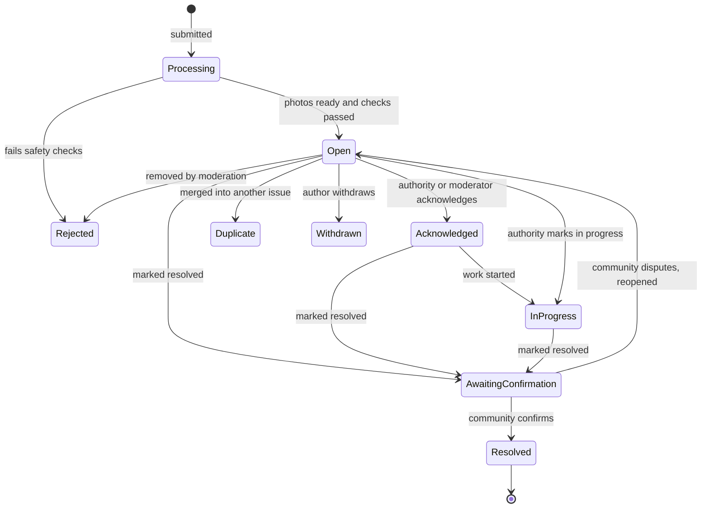

# Civic Pulse: Product Reference

**Version 0.2 (agent-ready) · 30 Sep 2026**

> **For AI coding agents (Antigravity and others):** this document is the product source of truth.
> 1. Read the sections relevant to your task in full before planning, and cite feature IDs and section numbers in plans and commits.
> 2. Build P1 only unless the prompt says otherwise. P2 and P3 rows exist so you leave the right hooks, not so you build them early.
> 3. Values marked *(tunable)* must live in configuration, never in component or handler code.
> 4. If something is ambiguous, use the recommended default in §15, log the assumption in `docs/DECISIONS.md`, and continue.
> 5. The privacy and integrity rules in §5 and §6 (fail-closed images, no metadata, idempotent and audited escalation) are non-negotiable. If a task seems to conflict with them, stop and ask.
> 6. The locked build stack is defined in `AGENTS.md`; §11 is background only.

**How to use this doc.** Feature IDs (e.g. `ESC-04`) are stable, so use them in tickets and commits. Priorities: **P1** = MVP / pilot launch, **P2** = fast follow, **P3** = later. Numbers marked *(tunable)* are starting defaults to adjust during the pilot. Open questions are collected in §15 as D1 to D14.

**Contents:** 1 Vision · 2 Roles · 3 Concepts · 4 Feature list · 5 Photo, location & privacy system · 6 Auto-escalation system · 7 Ranking, karma & anti-gaming · 8 Data model · 9 Lifecycle & resolution · 10 Limits & rules · 11 Suggested architecture · 12 Roadmap · 13 Metrics · 14 Risks · 15 Open decisions

---

## 1. Vision & principles

**One-liner.** Civic Pulse is a hyperlocal platform where residents report problems in their area, the community validates and ranks them, and popular issues are automatically escalated to the responsible local authority, with a public trail from "reported" to "resolved".

**The problem.** People have no simple way to report a local problem, see whether neighbours share it, know who is responsible, or find out whether anything happened. Today's channels (phone calls, office visits, scattered social posts) are fragmented and opaque.

**Principles**

1. **Resolution over engagement.** Success is issues resolved, not posts or time on site.
2. **Problems, not people.** Content is about issues and institutions, never about shaming individuals.
3. **Privacy by default.** Faces blurred, metadata stripped, minimal personal data leaves the platform.
4. **Signal over noise.** Support must come from real, distinct, local people, so anti-gaming is a core feature.
5. **Transparent by default.** Every issue has a public timeline and every escalation is visible.
6. **Local first.** Launch in one locality, then repeat the pattern.
7. **Mobile first.** Most reports will be made from a phone, at the spot.

**Decisions already made**

- Any civic problem is in scope: infrastructure, services and bureaucratic delays.
- Karma-style upvoting drives popularity.
- Issues that reach a popularity threshold are automatically sent to the responsible local authority.
- Photos are captured through the website and location is detected automatically.
- Every face in every image is blurred automatically.
- Authorities start as external recipients with no account (*assumption*; official accounts arrive in P3).

---

## 2. Users & roles

| Role | Who | Can do |
|---|---|---|
| Visitor | Not signed in | Browse public issues and the Pulse dashboard. No voting or commenting. |
| Resident | Signed in, phone or email verified | Post, support, comment, follow, flag. |
| Verified Resident | Locality confirmed (ACC-05) | Everything above, full weight toward escalation, can confirm resolutions. |
| Moderator | Trained volunteer or staff, per locality | Review flags, hide or restore content, merge duplicates, add blur boxes, warn users. |
| Locality Admin | Runs one locality's setup | Manage boundary, categories, authority routing, thresholds, escalation mode. |
| Platform Admin | Core team | Everything, plus audit logs, feature flags, kill switches. |
| Authority Contact | External recipient, no account | Acknowledge and update status through signed links (ESC-04). |
| Official Account | Verified department account (P3) | Post official updates, change status, reply publicly. |

---

## 3. Core concepts

- **Issue:** a post reporting one problem. Types: *location* (has a pin), *office* (tied to an office or department), or *both*.
- **Locality:** the geographic unit for feeds and thresholds (pilot: one ward, neighbourhood or campus). Has a boundary polygon.
- **Authority:** the body responsible for fixing a category of issue in an area (ward office, roads department, water board).
- **Support:** the positive signals on an issue: *Upvote* ("this should be fixed") and *Affected too* ("this affects me").
- **Support score (S):** weighted count of unique supporters; drives ranking and escalation (§7).
- **Karma:** a user's reputation, earned mostly from outcomes (§7).
- **Escalation:** automatic sending of an issue to its responsible authority once thresholds are met (§6).
- **Pulse:** the live, aggregate view of a locality's issues.

---

## 4. Feature list

Columns: ID · feature · priority · details. Sections 5 to 7 hold the detailed specs for photos and location, escalation, and ranking.

### 4.1 Accounts & identity (ACC)

| ID | Feature | Pri | Details |
|---|---|---|---|
| ACC-01 | Sign-up / login | P1 | Phone OTP (recommended: harder to mass-create than email) plus optional email or Google login. OTP rate limits, CAPTCHA on sign-up. |
| ACC-02 | Public handle | P1 | Unique pseudonym shown publicly; real name never required. Limited handle changes. |
| ACC-03 | Generated avatars | P1 | No photo avatars, so the "no faces" rule covers every image on the site. |
| ACC-04 | Home locality | P1 | Chosen at sign-up (suggested from device location, confirmed by the user). Other localities are read-only. |
| ACC-05 | Verified Resident | P1 | Phone-verified account with 2 location checks inside the locality on different days (a live-captured report, or a one-tap "I'm in [Locality] now" check in the profile, at most one per day), or manual approval by a moderator. Escalation thresholds count Verified Residents (§6.3, §7.1). |
| ACC-06 | Profile page | P1 | Handle, karma, level, badges, join date, issues reported, resolved count. No contact details. |
| ACC-07 | Anonymous posting | P2 | Public label "Anonymous resident", still tied to the account internally for moderation. Useful for sensitive service-delay reports. |
| ACC-08 | Account deletion & data export | P1 | User chooses: delete their issues, or keep them under "Deleted user". JSON export. Required by most privacy laws. |
| ACC-09 | Terms & age gate | P1 | Accept Terms, Privacy Policy and Guidelines; minimum age per local law (commonly 13 to 16+). |
| ACC-10 | Session security | P1 | Device/session list, log out everywhere. 2FA in P3. |

### 4.2 Reporting an issue (RPT)

| ID | Feature | Pri | Details |
|---|---|---|---|
| RPT-01 | Issue form | P1 | Title (10 to 100 chars), description (up to 2,000), category (required), issue type (location / office / both), severity (Nuisance / Inconvenient / Hazard), location or office, photos (up to 5), duration ("how long has this been a problem?"), prior attempts ("did you already report this? reference no."). |
| RPT-02 | Categories | P1 | Starter list: Roads & potholes · Streetlights & electricity · Water & drainage · Waste & sanitation · Public transport · Parks & public spaces · Public safety (non-emergency) · Noise & pollution · Encroachment & illegal construction · Health & education facilities · Government service delays · Other. Configurable per locality. |
| RPT-03 | Live capture & auto-location | P1 | See §5. |
| RPT-04 | Duplicate check | P1 | After location is set, show similar open issues nearby (same category within 200 m *(tunable)* plus text similarity) with a "Support this instead" button. Author may still post. Moderators can merge later; supporters carry over. |
| RPT-05 | Routing preview | P1 | Before submit: "If this gains enough support it will be sent to: [Authority]", with the threshold. |
| RPT-06 | Review-and-publish step | P1 | User sees processed (blurred) photos and final details, then taps Publish. Nothing is public until images pass the pipeline. |
| RPT-07 | Drafts & weak networks | P1 | Autosave; retry uploads on poor connections. Full offline draft queue in P2 (PWA). |
| RPT-08 | Edit rules | P1 | Free edits for 15 minutes *(tunable)*; afterwards edits are logged with visible history. Category and location lock once escalated. |
| RPT-09 | Delete / withdraw | P1 | Delete only if there are no supporters or comments; otherwise "Withdraw" (stays visible, marked withdrawn), so popular issues cannot vanish after escalation. |
| RPT-10 | Area-wide issues | P2 | Scope: Spot (pin) or Area (pin plus radius), for things like power cuts or water shortages. |
| RPT-11 | Service-delay template | P2 | Office name, application date, promised date, partial reference number; delay length is computed and displayed. |
| RPT-12 | Emergency notice | P1 | Shown for Hazard and Public safety: "Civic Pulse is not an emergency service. In immediate danger, call [local emergency number]." Configured per locality. |

### 4.3 Photos, location & privacy (IMG), spec in §5

| ID | Feature | Pri | Details |
|---|---|---|---|
| IMG-01 | In-browser camera capture | P1 | Live viewfinder in the site; native-camera fallback on mobile; gallery upload as a flagged fallback (§5.2). |
| IMG-02 | Auto-location | P1 | Device location at capture (primary), EXIF GPS (secondary), manual pin (fallback) (§5.3). |
| IMG-03 | "Location verified" badge | P1 | Shown only when the checks in §5.3 pass. |
| IMG-04 | Metadata stripping | P1 | All EXIF, XMP and IPTC removed from every stored image. |
| IMG-05 | Automatic face blur | P1 | Server-side, fail-closed, every image (§5.5). |
| IMG-06 | Manual blur tool | P1 | Users can add blur regions; nobody can remove a blur. |
| IMG-07 | "Report unblurred face" | P1 | One report hides the image instantly for review. |
| IMG-08 | On-device pre-blur | P2 | Faces blurred in the browser before upload, so raw faces never leave the phone. |
| IMG-09 | Number-plate blur | P2 | Vehicle plates detected and blurred. |
| IMG-10 | Duplicate-photo detection | P2 | Perceptual hash catches reused or re-posted images. |
| IMG-11 | Before / after photos | P2 | Live-captured "after" photo near the pin as resolution proof (§9). |
| IMG-12 | Video | P3 | Out of scope until the image pipeline is proven; moderation and blurring are far harder. |

### 4.4 Feed & discovery (FED)

| ID | Feature | Pri | Details |
|---|---|---|---|
| FED-01 | Locality feed | P1 | Default feed is the user's locality. Radius mode (1, 3, 5 km *(tunable)*) until boundaries are loaded. |
| FED-02 | Sort tabs | P1 | Trending, New, Top (week / month / all time), Unresolved, Most overdue, Recently resolved, Near me. |
| FED-03 | Filters | P1 | Category, status, severity, escalated, has photo, distance, date range. |
| FED-04 | Map view | P1 | Clustered pins coloured by status; tap for preview; search within map bounds. Heatmap in P2. |
| FED-05 | Issue card | P1 | Blurred photo, title, category and status chips, support and comment counts, age, distance, escalation badge, threshold progress. |
| FED-06 | Issue page | P1 | Gallery, description, map, support buttons, responsible authority, timeline, comments, related issues, share. |
| FED-07 | Search | P1 | Full-text over title, description, category, area. Typo tolerance in P2. |
| FED-08 | Follow / save issue | P1 | Get updates; saved list on profile. |
| FED-09 | Nearby alerts | P2 | "Tell me about new issues within X km", plus category follows. |
| FED-10 | Share & link previews | P1 | Public URL with social preview (blurred photo, title, support count, status); WhatsApp, X and copy-link buttons. |
| FED-11 | Public and indexable | P1 | Issue pages are public and search-indexable unless hidden or sensitive; sitemap per locality. |
| FED-12 | Browse other localities | P2 | Read-only. |

### 4.5 Community engagement (ENG)

| ID | Feature | Pri | Details |
|---|---|---|---|
| ENG-01 | Upvote | P1 | One per user per issue; removable. |
| ENG-02 | "Affected too" | P1 | One tap upgrades the upvote; optional "since when". Higher weight (§7.1). |
| ENG-03 | Comments | P1 | Up to 1,000 chars, one reply level, edit within 10 min *(tunable)*, delete own, sort by Top or Newest. No images in comments for the MVP. |
| ENG-04 | Helpful marks | P2 | Upvote comments; earns small karma. |
| ENG-05 | Comment tags | P2 | "Suggested fix" and "Who to contact" tags. |
| ENG-06 | Flag / report | P1 | On issues, comments and images. Reasons: spam, false info, harassment, private info, unblurred face or plate, offensive image, off-topic, duplicate, emergency. |
| ENG-07 | No downvotes | P1 | Deliberate: downvotes would let people bury neighbours' problems. Use flags instead (D3). |
| ENG-08 | "I can help" | P3 | Community groups or NGOs offer to fix or support an issue. |
| ENG-09 | Mentions | P3 | @handle in comments. |
| ENG-10 | Confirm hazard | P1 | On Hazard issues, a resident can tap "Confirm hazard" after a one-time location check within 500 m of the pin *(tunable)*. Three confirmations feed the fast-track rule (§6.3). |

### 4.6 Ranking, karma & anti-gaming (RNK), spec in §7

| ID | Feature | Pri | Details |
|---|---|---|---|
| RNK-01 | Weighted support score | P1 | §7.1. |
| RNK-02 | Trending / Top / Most overdue ranking | P1 | §7.2. |
| RNK-03 | Outcome-based karma | P1 | §7.3. |
| RNK-04 | Levels and badges | P1 levels, P2 badges | §7.4. |
| RNK-05 | Anti-gaming controls | P1 | §7.5. |
| RNK-06 | Leaderboards | P2 | Weekly and monthly top contributors, ranked by confirmed outcomes rather than vote counts. |

### 4.7 Issue lifecycle (LIF), spec in §9

| ID | Feature | Pri | Details |
|---|---|---|---|
| LIF-01 | Status workflow | P1 | Processing → Open → Acknowledged → In progress → Awaiting confirmation → Resolved; side states Duplicate, Rejected, Withdrawn. |
| LIF-02 | Who can change status | P1 | Authority via signed link, moderators and admins (logged with reason); authors can withdraw. Nobody confirms their own resolution. |
| LIF-03 | Public timeline | P1 | Every event: posted, milestones, escalations, deliveries, acknowledgements, updates, resolutions. |
| LIF-04 | Author updates | P1 | Author can append dated updates (with photos) after the edit window. |
| LIF-05 | Community-confirmed resolution | P2 | §9. In P1, a moderator or admin confirms. |
| LIF-06 | Before / after view | P2 | Blurred side-by-side, shareable. |
| LIF-07 | Reopen & dispute | P2 | Community "still not fixed" reopens the issue and re-notifies the authority. |
| LIF-08 | Recurrence link | P2 | "Same problem again" on a resolved issue creates a new linked issue; tracks repeat failures. |
| LIF-09 | Stale-issue check | P2 | After 90 days *(tunable)* without activity, ask the author "Still a problem?"; archive if no. |
| LIF-10 | Duplicate merge | P1 | Moderator merges; supporters and comments carry over; old URL redirects. |

### 4.8 Auto-escalation (ESC), spec in §6

| ID | Feature | Pri | Details |
|---|---|---|---|
| ESC-01 | Threshold engine | P1 | Tiered thresholds L0 to L3 per locality, category and severity (§6.3). |
| ESC-02 | Authority routing | P1 | Category plus location resolves to the responsible authority (§6.4). |
| ESC-03 | Escalation packet | P1 | Email with blurred photos, map link, support stats and response links (§6.5). |
| ESC-04 | Authority response links | P1 | Signed one-click Acknowledge / In progress / Resolved / Wrong department; no login. |
| ESC-05 | Reminders & next-level escalation | P1 | Reminders at +7, +14, +30 days, then L2 (§6.7). |
| ESC-06 | Rollout modes | P1 | Off → Shadow → Approve → Auto, per locality (§6.8). |
| ESC-07 | Public threshold progress | P1 | Progress bar on every issue ("18 of 25 supporters needed"). |
| ESC-08 | Public escalation timeline | P1 | Sent, delivered and acknowledged events shown on the issue. |
| ESC-09 | Guardrails | P1 | Rate limits, digests, clustering, freeze-after-send, kill switch (§6.8). |
| ESC-10 | Portal / API adapters | P2 | Integrate with official grievance systems (§6.6). |
| ESC-11 | WhatsApp / SMS for hazards | P2 | Faster channel for urgent escalations. |
| ESC-12 | Reply-by-email parsing | P2 | Authority replies are captured onto the timeline. |

### 4.9 Pulse dashboard & accountability (PLS)

| ID | Feature | Pri | Details |
|---|---|---|---|
| PLS-01 | Locality Pulse page | P1 | Open and resolved counts, resolved this month, median time to first response, median time to resolution, top 10 unresolved by support, category breakdown, trending this week, new-vs-resolved trend, map. |
| PLS-02 | Personal impact page | P1 | Issues you reported, supported and saw resolved. |
| PLS-03 | Authority scoreboard | P2 | Per authority: issues received, acknowledgement rate, median response time, resolution rate, backlog. Public, labelled "based on Civic Pulse reports, not official statistics", with a right of reply. |
| PLS-04 | Locality report | P2 | Auto-generated weekly or monthly "Top unresolved issues" page and PDF; shareable, sent to authorities and representatives. |
| PLS-05 | Open data export | P3 | Anonymised CSV / API for journalists and researchers. |

### 4.10 Notifications (NTF)

| ID | Feature | Pri | Details |
|---|---|---|---|
| NTF-01 | Channels | P1 / P2 / P3 | P1 in-app and email; P2 web push (PWA); P3 SMS / WhatsApp. |
| NTF-02 | Author events | P1 | Photos processed, post live, support milestones (10, 25, 50, 100), escalated, delivered, acknowledged, status change, comments (batched), resolution confirmation requests, moderation decisions. |
| NTF-03 | Supporter / follower events | P1 | Escalation, status changes, resolution confirmation request. |
| NTF-04 | Moderator & admin alerts | P1 | New flags, unblurred-face reports, delivery failures, unrouted issues. |
| NTF-05 | Preferences | P1 | Per channel and per type toggles, quiet hours, daily or weekly digest. |
| NTF-06 | Batching & limits | P1 | Group similar events, cap notifications per hour, unsubscribe link in every email. |

### 4.11 Trust, safety & moderation (MOD)

| ID | Feature | Pri | Details |
|---|---|---|---|
| MOD-01 | Guidelines & Terms | P1 | Rules in §10, accepted at sign-up. |
| MOD-02 | Flag intake & queue | P1 | Sorted by severity and flag count. Actions: approve, hide, edit out personal info, merge, warn, suspend, ban. Reason codes; audit-logged. |
| MOD-03 | Auto-moderation | P1 | Profanity and hate filter; PII detection in text (phone numbers, emails, ID numbers, vehicle plates) with warn or redact; NSFW / graphic image classifier; spam heuristics (new account plus links plus repetition). |
| MOD-04 | Auto-hide | P1 | Hide pending review at N flags from distinct users *(tunable)*, weighted by flagger reliability to resist brigading. Unblurred-face reports hide instantly. |
| MOD-05 | Escalation hold | P1 | Flagged or under-review issues cannot escalate (§6.2). |
| MOD-06 | Sanction ladder | P1 | Warning, 24 h posting block, 7 days, permanent; shadow-limit for spam; karma penalties. |
| MOD-07 | Appeals | P2 | A second moderator reviews. |
| MOD-08 | Sensitive-category hold | P2 | Reports of misconduct or corruption are reviewed before going public and must be factual. |
| MOD-09 | Takedown & right of reply | P1 process, P2 tooling | Contact channel for individuals, officials and authorities; logged, with a response SLA. |
| MOD-10 | Moderator onboarding & conflicts | P1 | Guidelines training; moderators cannot act on issues they authored or supported. |
| MOD-11 | Transparency report | P3 | Monthly moderation stats. |

### 4.12 Admin & operations (ADM)

| ID | Feature | Pri | Details |
|---|---|---|---|
| ADM-01 | Locality setup | P1 | Boundary upload (GeoJSON / KML), map centre, categories, languages, time zone, emergency numbers. |
| ADM-02 | Authority directory | P1 | Name, level, parent (escalation chain), jurisdiction polygon, categories, contact channels, languages, working hours, expected response time, verified flag, delivery health. |
| ADM-03 | Routing tester | P1 | Enter a category and coordinates; see the resolved authority and why. |
| ADM-04 | Threshold config | P1 | Per locality, category and severity; versioned with effective date; mode Off / Shadow / Approve / Auto. |
| ADM-05 | Escalation console | P1 | Queue, sent, failed, unrouted. Approve, resend, "escalate now", retract; pause per authority, per locality or globally. |
| ADM-06 | Template editor | P1 | Email templates with variables, preview, per-language versions. |
| ADM-07 | User management | P1 | Search, activity, sanctions, manual verification. |
| ADM-08 | Analytics dashboard | P1 | Engagement, resolution, response times, pipeline health, flags, escalations (§13). |
| ADM-09 | Audit log | P1 | Immutable record of every admin, moderator and system action. |
| ADM-10 | Feature flags & config | P1 | Toggle features per locality without deploys. |
| ADM-11 | Team-reported issues | P1 | Staff can post on behalf of partner groups during the pilot, clearly labelled. |
| ADM-12 | Data-request tools | P1 | Export, deletion and legal takedown handling. |

### 4.13 Support, content & growth (SUP)

| ID | Feature | Pri | Details |
|---|---|---|---|
| SUP-01 | Onboarding | P1 | Three-screen intro and a guided first report. |
| SUP-02 | Static pages | P1 | About, How it works, Guidelines, Terms, Privacy, Contact, FAQ. |
| SUP-03 | Feedback | P1 | In-app feedback and bug-report button. |
| SUP-04 | Waitlist | P1 | For areas where Civic Pulse is not live yet. |
| SUP-05 | Invite neighbours | P2 | Referral link and printable QR poster for a locality. |
| SUP-06 | Changelog / status page | P3 | Public release notes and uptime. |

### 4.14 Non-functional requirements (NFR)

- **Mobile first, low-end friendly.** Responsive, installable PWA (P2), usable on 3G/4G: client-side image compression, lazy loading, skeleton screens. Targets *(tunable)*: feed p95 under 1.5 s on 4G, issue page LCP under 2.5 s, photo processing p95 under 10 s.
- **Accessibility.** WCAG 2.1 AA, keyboard navigation, sufficient contrast, status never shown by colour alone, alt text (user-provided or generated from category).
- **Internationalisation.** All strings externalised from day one; local language(s) at launch (D11); RTL-ready. Auto-translation of posts is P3.
- **Security.** HTTPS everywhere (also required for camera and location APIs), OWASP Top 10 controls, CSRF/XSS protection, rate limiting, strict upload validation, signed URLs for private assets, secrets management, dependency scanning, bot protection.
- **Reliability.** Queue-based jobs with retries and dead-letter queues; idempotent escalation sending (never double-send); daily backups with tested restores; monitoring and alerting.
- **SEO & sharing.** Server-rendered public pages, Open Graph tags, sitemaps.
- **Observability.** Structured logs, metrics and tracing, especially on the image and escalation pipelines.
- **Analytics.** Privacy-friendly and cookieless where possible; consent where the law requires it.
- **Legal.** Terms, Privacy Policy, cookie notice, Guidelines, takedown policy; compliance with the data-protection law of the launch region (e.g. GDPR, CCPA, DPDP).

---

## 5. Photo capture, location & privacy system

### 5.1 Goals

Photos are fresh and taken at the spot · location fills in automatically · no face or hidden metadata ever reaches public view · it all works on low-end phones and weak networks.

### 5.2 Capture flow

1. **Prime permissions.** A short screen explains why camera and location are needed before the browser prompt appears. Both APIs require HTTPS.
2. **Live capture.** The camera opens inside the page (live viewfinder, rear camera by default). Where that fails on mobile, fall back to the native camera through a file input with `capture="environment"`. Up to 5 photos per issue.
3. **Record capture context** for every shot: device coordinates, accuracy in metres, timestamp. This matters because frames grabbed from a live viewfinder carry no EXIF at all.
4. **Location step.** A map shows the pin and reverse-geocoded address; the user can drag to adjust. If accuracy is worse than about 50 m *(tunable)*, ask them to place the pin precisely.
5. **Client-side prep.** Apply orientation, downscale to about 1,600 px on the long edge *(tunable)*, compress (JPEG or WebP, around 80% quality), upload with the location payload.
6. **Server processing** (§5.4), shown as "Processing photos…" (target under 10 s).
7. **Review and publish.** The user sees the blurred result, can add more blur regions or retake, then publishes.

**Gallery-upload fallback.** Allowed for desktop users, blocked cameras and accessibility. The post gets a "Location not verified" label and requires a manual pin. Recommended default: live capture is the main path, and only live-captured photos can earn the verified-location badge (D4).

### 5.3 Location resolution

Priority order:

1. **Device geolocation at the moment of the shot.** Primary source. Browsers give no EXIF for live frames, and EXIF GPS is often missing or stripped elsewhere (behaviour varies by OS, browser and camera settings).
2. **EXIF GPS in the image file.** Secondary source and cross-check. Read it before stripping.
3. **Manual pin or address search.** Fallback and adjustment.

Stored per issue: `location` (point), `location_source` (`device_gps` / `exif_gps` / `manual_pin`), `location_accuracy_m`, `location_verified`.

`location_verified = true` only if all of these hold *(thresholds tunable)*:

- the source is device or EXIF, and the point is inside the locality boundary
- if both device and EXIF locations exist, they agree within 100 m
- the capture time (server clock) is within 10 minutes of upload
- the IP-based city-level location does not contradict it (optional sanity check; skip it if no IP-geolocation source is configured)

Also:

- Reverse-geocode to an address and admin areas (ward, municipality, district). Cache results. Work out the jurisdiction with point-in-polygon on our own boundary data, not the geocoder's.
- A point outside every live locality shows "Civic Pulse isn't live here yet" plus the waitlist.
- Only the issue pin is stored. If the reporter moves the pin, their raw position is discarded, so someone reporting from home does not leak their address.
- Honest limit: GPS and EXIF can be spoofed. "Verified" means consistent, not proven. Community confirmation and anti-gaming (§7) cover the rest.
- Office-based issues need no capture location.

### 5.4 Server pipeline (in order)

1. **Validate:** magic-byte file type, size and dimension limits, decompression-bomb guard.
2. **Extract** EXIF GPS, time and orientation into database fields. This is the only place metadata survives.
3. **Normalise:** apply orientation, convert HEIC/PNG to JPEG or WebP, fully re-encode.
4. **Strip** everything else: EXIF, XMP, IPTC, embedded thumbnails.
5. **Content-safety check** (nudity, graphic violence): block or route to moderation.
6. **Face detection and blur** (§5.5). Fail closed.
7. **P2:** number-plate blur; flag images of documents or screens.
8. **Generate variants** (thumbnail, card, full, social-share image) from the blurred master only.
9. **P2:** perceptual hash for duplicate-photo detection.
10. **Publish** to the CDN under unguessable filenames; mark ready.
11. **Schedule deletion** of the raw upload (§5.6).

Run as background jobs with retries and a dead-letter queue.

### 5.5 Face blurring

- **Scope:** every image (issue photos, updates, resolution photos, any future comment images). Avatars are generated, never uploaded.
- **Enforcement point:** the server. Client-side blur (P2) improves privacy and preview speed but is never the only gate, because clients can be bypassed.
- **Detection:** a high-recall detector, self-hosted (e.g. YuNet, RetinaFace, SCRFD) or a cloud API (e.g. AWS Rekognition, Google Cloud Vision). Run at multiple scales or tiles so small, distant faces are caught. Set the confidence threshold low: over-blurring is acceptable, missing a face is not. Cover profiles, tilted heads, masks, sunglasses, low light and children.
- **Person-detector fallback (P2):** if a person is detected but no face is found in the head region, blur the estimated head area.
- **Method:** expand each box by roughly 25 to 30%, then apply strong obfuscation (large-kernel blur combined with coarse pixelation, or a solid fill). Light blur or small-block pixelation can be partly reversed or still recognised.
- **Fail closed:** if detection errors or times out, the image is not published.
- **User controls:** users can add blur regions in the review step; nobody can remove a blur. Statues, posters and billboards may be blurred as false positives, which is accepted.
- **Community backstop:** every image has "Report unblurred face". One report hides the image immediately; a moderator adds blur boxes to the processed master (no raw needed) and restores it. Target review time under 1 hour *(tunable)*.
- **Derived images:** thumbnails, share previews, escalation packets and before/after views all use the blurred master.
- **Quality bar** *(tunable)*: build a labelled test set of at least 500 civic-scene photos (crowds, distant people, night, profiles, children, masks). Target at least 98% recall on faces over 24 px. After launch, audit 1 to 2% of published images weekly and alert if unblurred-face reports exceed 1 per 1,000 images.
- **Limits to state in the Terms and UI:** blurring reduces but does not eliminate identifiability (clothing, context). The capture screen nudges: "Frame the problem, not the people."

### 5.6 Storage & retention

- **Public bucket:** processed, metadata-free variants only.
- **Raw upload:** private, encrypted bucket; nobody can view it; deleted 24 hours *(tunable)* after successful processing (kept only so failed jobs can be re-run). Alternative: delete immediately (D5).
- **Reporter's raw coordinates:** not stored beyond the derived fields.
- **Account deletion:** cascades per ACC-08.

### 5.7 Failure handling

| Situation | Behaviour |
|---|---|
| Camera permission denied | Gallery upload plus manual pin, labelled "not verified". |
| Location permission denied | Try EXIF from the file; otherwise manual pin. |
| No GPS in EXIF and no permission | Manual pin. |
| Poor GPS accuracy | Prompt the user to adjust the pin. |
| HEIC or unusual format | Convert server-side. |
| Weak network | Resumable upload, retry queue, draft kept. |
| Detector down or timing out | Fail closed, retry queue, tell the user photos are taking longer. |
| Desktop without a webcam | Upload path. |
| Rotated or mirrored phone images | Normalise orientation before stripping metadata. |

### 5.8 Test checklist

- An automated check in CI (e.g. exiftool on outputs) proves no processed image contains metadata.
- Fixtures: with and without EXIF, rotated, HEIC, very large, crowds, night, children, masks, faces on posters and statues.
- Assert that every variant and share image derives from a blurred master.
- Re-run the labelled face test set whenever the model changes.

---

## 6. Auto-escalation system

### 6.1 Principles

Automated, fair, hard to game, transparent, and respectful of authorities' inboxes. Escalation is a formal report, not a guarantee of action, and the UI says so.

### 6.2 Eligibility gates

An issue can escalate only when all of these hold:

1. Status is Open (or reopened); not withdrawn, duplicate or rejected.
2. It passed moderation with no active flags, including unblurred-face flags.
3. A responsible authority was found (otherwise it goes to the admin "Unrouted" queue).
4. Minimum age reached (24 to 48 h *(tunable)*), so duplicates can merge and flash mobs cool off.
5. The threshold is met (§6.3).
6. It is complete enough: category plus location or office, and at least one photo for location issues.
7. It has not already escalated at this level.

### 6.3 Thresholds (starter values, all tunable)

Definitions: **S** = weighted support score (§7.1). **V** = distinct Verified Residents supporting. **A** = locality users active in the last 30 days.

| Level | Name | Trigger | Sent to | Purpose |
|---|---|---|---|---|
| L0 | Nudge | S ≥ 5 and age ≥ 24 h | Author only | Prompt to add detail or a better photo |
| L1 | Notify | S ≥ max(25, 2% of A), V ≥ 10, at least half of supporters inside the locality, age ≥ 48 h | Responsible authority | Formal report |
| L2 | Escalate | No acknowledgement 7 days after L1, or S ≥ max(100, 5% of A) | Next-level authority plus elected representative | Pressure |
| L3 | Public follow-up | No acknowledgement 21 days after L2 | Everyone above, and the issue is featured in the locality's "Top unresolved" report | Accountability |
| Fast track | Hazard | Severity = Hazard, S ≥ 5, V ≥ 3, and at least 3 users confirm "this is a hazard" from within 500 m of the pin (ENG-10) | Responsible authority, marked URGENT | Safety |

Scaling with locality size (the `max(...)` terms) stops big localities from escalating on trivial numbers and stops tiny pilots from being unreachable. Per-category multipliers let small hyper-local issues (a streetlight) need fewer supporters than city-wide ones.

### 6.4 Routing: which authority gets it

The authority directory (ADM-02) stores jurisdiction polygons, categories handled, contact channels and the escalation chain.

1. Office-based issue: the named office, if it is in the directory.
2. Location-based issue: point-in-polygon on jurisdiction polygons, filtered by category; choose the most specific level (ward before city).
3. Shared responsibility: primary recipient plus cc.
4. No match: "Unrouted" queue for admins, with a fallback to the locality's general grievance address.
5. Store a routing explanation (which rule matched) with every escalation.

The issue page shows the responsible authority and threshold progress before anything is sent.

### 6.5 Escalation packet

- Reference ID (e.g. `CP-2026-000123`), title, category, severity, description.
- Address, coordinates, map link.
- Blurred photos (links plus thumbnails).
- First reported date and days open.
- Support: unique supporters, verified locals, "affected too" count, and which threshold triggered the send.
- Link to the public issue page, and prior-attempt info if the reporter gave it.
- The ask: acknowledge and give an expected resolution date.
- Signed one-click links: **Acknowledge**, **In progress** (with ETA), **Resolved**, **Wrong department** (suggest the right one), **Need more information**.
- Privacy: pseudonym only. No reporter email, phone or real name unless the reporter opts in to share contact details (P2).
- Neutral, factual wording; per-language templates; legal review of templates.

### 6.6 Delivery channels

| Pri | Channel | Notes |
|---|---|---|
| P1 | Email | From a dedicated, authenticated domain (SPF, DKIM, DMARC), unique reply-to per escalation. |
| P1 | Signed status links | Authority responds without an account. |
| P2 | Portal / API adapters | One adapter per official grievance system. Prefer official APIs or agreed channels over scraping or auto-filling web forms. |
| P2 | WhatsApp / SMS | For hazard escalations. |
| P2 | Digest mode | Per authority: a daily or weekly ranked list instead of one email per issue. |
| P2 | Reply-by-email parsing | Replies land on the timeline. |
| P3 | PDF report, official-account inbox | |

Sending is idempotent: a ledger row per (issue, level) is checked before every send; failures retry with backoff; bounces flag the contact for admin review.

### 6.7 Tracking & follow-up

- Delivery states: queued → sent → delivered → opened (where trackable) → acknowledged → responded; or bounced / failed.
- Authority responses appear on the public timeline, labelled "Authority response".
- "Wrong department" re-routes to the suggested authority (admin-approved in early phases) and is logged.
- Reminders at +7, +14 and +30 days after L1 without acknowledgement *(tunable)*, maximum 3, batched into one email per authority; then L2 rules apply.
- Author, supporters and followers are notified at every state change.
- Resolution cancels pending reminders.

### 6.8 Guardrails & rollout

**Rollout modes (per locality):** Off → **Shadow** (log what would be sent, send nothing) → **Approve** (an admin clicks send) → **Auto**. Move up only after reviewing the previous mode's output. Shadow mode is also how thresholds get tuned.

**Guardrails**

- Rate limit per authority (max N emails per day *(tunable)*); overflow goes into a digest.
- Cluster near-identical issues into one packet with the combined support.
- Core fields freeze after escalation; later changes go out as an "update", not a new escalation.
- Verified authority contacts only; admin approval for new entries.
- Bounce and complaint handling; opt-out requests are resolved by admins changing the channel, never ignored.
- Kill switch: global, per locality, per authority.

### 6.9 Audit & edge cases

- Each escalation stores the threshold version, support snapshot (S, V, counts), routing explanation, template version, payload snapshot and delivery events, so anyone can answer "why was this sent, to whom, and when?".
- **Merged after escalation:** keeps its ledger, supporters combine, no re-send until the next threshold.
- **Resolved before L2:** cancel reminders and L2.
- **Resolution disputed:** reopen, notify the authority with the evidence, restart timers from the reopen date.
- **Supporters withdraw after send:** nothing is unsent; scores update.
- **Fraud found after send:** admin uses "Retract escalation", which sends a standard correction to the authority and is logged.
- **Author deletes account:** the issue stays under "Deleted user".
- **No authority in the directory:** the issue sits in Unrouted; the author sees "We're finding the right office."

---

## 7. Ranking, karma & anti-gaming

### 7.1 Support signals and weights

One support record per user per issue. "Affected too" includes the upvote (one tap upgrades). There are no downvotes; flags handle abuse (D3). The public UI shows simple counts; the internal weighted score **S** drives ranking and escalation.

| Supporter | Upvote | Affected too |
|---|---|---|
| Verified Resident in the locality | 1.0 | 2.0 |
| Resident (unverified) in the locality | 0.5 | 1.0 |
| Outside the locality | 0.25 for ranking, 0 for escalation | same |
| Account under 24 h old | 0 until it ages | 0 |
| Member of a flagged suspicious cluster | 0 | 0 |

Weights are *(tunable)* and not published exactly, which makes gaming harder.

### 7.2 Ranking

- **Trending:** `rank = S / (age_hours + 2)^g`, with g = 1.5 *(tunable)*, recomputed every few minutes.
- **Top:** S over a selectable window (week, month, all time).
- **Most overdue:** issues unresolved for 14+ days ranked by `S × ln(days_open)`, so old, well-supported problems do not decay out of sight. This is the accountability view.
- **New:** chronological.

### 7.3 Karma events *(all tunable)*

Karma rewards outcomes over raw likes.

| Event | Points |
|---|---|
| Issue published (passes moderation) | +2 (max 3 per day) |
| Every 5 unique verified supporters on your issue | +1 (max +10 per issue) |
| Your issue reaches L1 escalation | +20 |
| Authority acknowledges your issue | +10 |
| Your issue is resolved and community-confirmed | +50 |
| You confirm someone's resolution (with live after-photo) | +5 |
| You support an existing issue instead of posting a duplicate | +1 |
| Your comment gets 5+ helpful marks | +1 (max 5 per day) |
| Your flag is upheld by a moderator | +2 |
| Your issue is removed for breaking the rules | −20 |
| Confirmed false or malicious report | −50 plus sanction |
| Repeatedly rejected flags | −2 each |

### 7.4 Levels & badges

- **Levels:** Newcomer (0), Neighbour (50), Advocate (200), Champion (1,000). Neighbour raises daily limits; Advocate can confirm resolutions early and flags carry more weight; Champion becomes eligible for a moderator invitation.
- **Badges (P2):** First Report, Resolver (3 confirmed resolutions), Eagle Eye (5 upheld flags), Good Neighbour (10 helpful comments). No streak mechanics; they encourage spam.

### 7.5 Anti-gaming controls

- One account per phone number; block disposable numbers; limit number reuse.
- **Vesting:** new accounts' support counts 0 toward escalation until 24 h old *(tunable)* with a verified phone.
- **Locality-only weight:** only in-locality users count toward escalation.
- **Velocity checks:** a burst of support (e.g. more than 20 in 5 minutes *(tunable)*) suspends weights and queues a review.
- **Cluster detection:** accounts sharing device fingerprints, IP ranges or sign-up times, or that always vote together, are discounted and flagged.
- **Moderator tool:** view the support graph on any issue before or after escalation.
- **Recalculation:** removing accounts recomputes S; if already escalated, use Retract (§6.9).
- **Rules:** vote buying and coordinated brigading are sanctionable in the Guidelines.
- Rate limits on supporting (§10).

---

## 8. Data model

Suggested store: PostgreSQL with PostGIS (radius queries, polygons, point-in-polygon routing). Geometry columns get GiST indexes; the feed needs an index on `(locality_id, status, trend_score)`.

| Entity | Key fields |
|---|---|
| `users` | id, handle, phone_hash, email, locality_id, role, is_verified_resident, karma, status, age_confirmed_at, created_at, last_active_at, deleted_at |
| `localities` | id, name, boundary (polygon), center (point), timezone, languages, emergency_numbers, escalation_mode, active |
| `categories` | id, slug, names (per language), icon, threshold_multiplier, is_sensitive, enabled_localities |
| `authorities` | id, name, level, parent_id (escalation chain), jurisdiction (polygon), category_ids, languages, expected_response_days, verified, status, digest_mode |
| `authority_contacts` | id, authority_id, channel (email / portal / sms / whatsapp / api), address, is_primary, last_delivery_status |
| `issues` | id, ref_code, author_id, locality_id, category_id, title, description, issue_type, severity, scope (spot / area), location (point), radius_m, location_source, location_accuracy_m, location_verified, address_text, admin_areas, office_name, authority_id, is_anonymous, duration_text, prior_report_ref, status, support_count, affected_count, weighted_score, verified_supporter_count, comment_count, trend_score, escalation_level, created_at, first_response_at, resolved_at, hidden_reason |
| `issue_images` | id, issue_id, uploader_id, kind (problem / update / after), master_key, variants, faces_blurred, manual_regions, plates_blurred, phash, captured_at_server, capture_meta, processing_status, moderation_status, raw_delete_at |
| `issue_links` | id, from_issue_id, to_issue_id, type (duplicate / related / recurrence) |
| `supports` | id, issue_id, user_id, type (upvote / affected), weight, in_locality, device_hash, ip_hash, created_at; unique on (issue_id, user_id) |
| `hazard_confirmations` | id, issue_id, user_id, distance_m, created_at; unique on (issue_id, user_id) |
| `comments` | id, issue_id, user_id, parent_id, body, kind (comment / fix / official), status, created_at, edited_at |
| `flags` | id, target_type, target_id, reporter_id, reason, note, status, resolved_by, created_at |
| `status_events` | id, issue_id, actor_type, actor_id, from_status, to_status, note, visibility, created_at |
| `resolution_votes` | id, issue_id, user_id, verdict (yes / no / partly), image_id, created_at |
| `escalations` | id, issue_id, level, authority_id, channel, status, rule_version, support_snapshot, routing_explanation, template_version, payload_snapshot, idempotency_key, response_token_hash, sent_at, delivered_at, acknowledged_at, next_reminder_at |
| `escalation_events` | id, escalation_id, event (queued / sent / delivered / opened / bounced / acknowledged / responded / retracted), payload, created_at |
| `threshold_configs` | id, locality_id, category_id (nullable), level, params, mode, version, effective_from, created_by |
| `notifications` | id, user_id, type, issue_id, channel, status, created_at, read_at |
| `karma_events` | id, user_id, event_type, points, issue_id, created_at |
| `user_badges` | user_id, badge, awarded_at |
| `moderation_actions` | id, moderator_id, target_type, target_id, action, reason_code, note, created_at |
| `audit_log` | id, actor_id, action, entity, before, after, ip_hash, created_at |
| `locality_reports` | id, locality_id, period, snapshot, published_at |
| `waitlist` | id, contact, coordinates, created_at |

---

## 9. Lifecycle & resolution

Escalation is a separate track (levels L0 to L3), not a status. Status describes the problem; escalation describes who has been told.

### Resolution confirmation (LIF-05)

1. Someone (authority via link, author, or moderator) marks the issue **Resolved**. It moves to *Awaiting confirmation* for 7 days *(tunable)*.
2. The system asks up to 10 *(tunable)* verified locals who supported the issue (prioritising "affected too" and those nearest the pin): "Is this fixed?" **Yes / No / Partly**, with an optional live "after" photo taken within 50 m of the pin.
3. Outcome: at least 3 Yes and Yes outnumbering No → **Resolved**. More No than Yes → back to **Open** (disputed), the authority is re-notified with the evidence. No responses by the deadline → **Resolved**, tagged "unconfirmed".
4. Neither the author nor the authority can confirm their own resolution; community confirmation is the source of truth.
5. Confirmed resolutions can show a blurred before/after view and trigger karma (§7.3).

---

## 10. Limits & rules

**Rate limits** *(tunable)*

| Action | New account (under 7 days) | Established |
|---|---|---|
| Issues per day | 2 | 5 |
| Comments per day | 20 | 60 |
| Supports per day | 50 | 200 |
| Flags per day | 10 | 20 |
| OTP requests per hour | 5 | 5 |

**Content rules (skeleton for the public Guidelines)**

1. Report problems and institutions, not private individuals. Refer to officials by office or role; keep statements factual and relevant.
2. No faces, personal data or private details: phone numbers, ID numbers, vehicle plates, home addresses. Redact reference numbers to the last 4 digits.
3. Be truthful. No exaggeration or fabrication.
4. No hate speech, harassment or threats.
5. No party-political campaigning or promotion.
6. Civic scope only: no ads, personal disputes or emergencies.
7. One issue per post; search before posting.
8. No vote manipulation, vote buying or brigading.

---

## 11. Suggested architecture (adjustable)

*Background only. The stack actually used for the build is locked in `AGENTS.md`.*

- **Frontend:** React with server rendering (e.g. Next.js) for SEO and share previews; installable PWA; MapLibre or Leaflet with OpenStreetMap tiles (or a paid tile provider).
- **Backend:** Node (NestJS / Express) or Python (FastAPI / Django), REST or GraphQL.
- **Database:** PostgreSQL + PostGIS. Redis for caching, rate limiting and queues.
- **Jobs:** a queue (BullMQ, Celery or similar) for the image pipeline, ranking recompute, escalation scheduler, notification fan-out.
- **Storage:** S3-compatible object storage behind a CDN; separate private bucket for raw uploads.
- **Image and AI workers:** Python with OpenCV / Pillow / libvips; face detector (§5.5); NSFW classifier; plate detector (P2). Benchmark self-hosted against cloud APIs on the face test set (D6).
- **Geo:** OSM-based geocoder (Nominatim / Photon) or a paid geocoder; check usage policies and cost; cache results. Boundary data from official GIS or OSM.
- **Email:** transactional provider with authenticated domain and inbound parsing.
- **Auth:** SMS OTP provider plus email login.
- **Ops:** error tracking, metrics and dashboards, containerised deploys, one region near the pilot users.

---

## 12. Roadmap

**Phase 0: Groundwork (before code)**

- Choose the pilot locality (D1) and collect its boundary data.
- Build the authority directory for the pilot: names, categories, verified contact channels. Contact each authority personally, explain what will arrive and why, agree a channel, and ask them to whitelist the sending domain. Unannounced automated email risks landing in spam or being ignored.
- Draft Terms, Privacy Policy and Guidelines (§10) and get a legal review for the launch region.
- Recruit and train 3 to 5 volunteer moderators.
- Line up 2 to 3 local groups (resident associations, student groups, NGOs) to seed real issues.
- Assemble the face test set (§5.5).

**Phase 1: MVP pilot (all P1)**

Scope: accounts with Verified Resident checks, reporting with live capture, auto-location and face-blur pipeline, feed and map, support and comments, lifecycle with authority links, escalation in Shadow then Approve mode, moderation basics, Pulse v1, in-app and email notifications, admin tools.

Acceptance criteria:

- A first-time user on a mid-range phone can report a geotagged, blurred issue in under 2 minutes.
- 100% of published images pass the automated "no metadata, faces blurred" check, and face-test recall meets the §5.5 target.
- The routing tester picks the correct authority for all test issues (build 20 across categories and areas).
- A shadow-mode escalation produces a complete, correct packet and a working signed response link.
- Flagged content reaches the moderator queue and can be hidden within minutes.
- At least 30 real, seeded issues are live at launch.

**Phase 2: Trust and accountability**

Community-confirmed resolution, before/after, authority scoreboard, locality reports, Auto escalation mode, WhatsApp/SMS for hazards, PWA push and offline drafts, on-device pre-blur, plate blur, anonymous posting, duplicate-photo detection, area-wide issues, nearby alerts, appeals, second locality.

**Phase 3: Scale and integration**

Official accounts, portal/API integrations, auto-translation, open data, sensitive-category workflows, moderation transparency reports, volunteer and NGO features, native wrapper if PWA limits bite.

---

## 13. Metrics

- **North star:** confirmed resolutions per locality per month.
- **Outcomes:** % of escalated issues acknowledged within 7 days; median time to first response; median time to resolution; resolution rate at 30 and 90 days.
- **Engagement:** weekly active residents as a share of estimated locality population; reports per active user; supports per issue; share of issues with at least one comment; week-4 retention.
- **Quality:** duplicate rate; share of issues with verified location; flag rate; median moderation time.
- **Pipeline health:** photo processing p95; processing failure rate; unblurred-face reports per 1,000 images; escalation delivery and bounce rates; retracted escalations.
- **Guardrails:** harassment reports per 1,000 posts; suspected fake-account rate.

---

## 14. Risks & mitigations

| Risk | Mitigation |
|---|---|
| Authorities ignore escalations | Onboard them first (Phase 0), reminders and next-level escalation, public timelines and scoreboard, exportable reports for press and representatives. |
| Vote brigading or fake accounts | §7.5: vesting, locality-only weight, velocity and cluster detection, Approve mode before auto-send. |
| Unblurred face or privacy leak | Fail-closed pipeline, instant hide on report, weekly audits, short raw retention, legal review. |
| Defamation or naming individuals | Guidelines, PII detection, sensitive-category hold, takedown and right-of-reply process. |
| Empty platform | One-locality pilot, seeding through local groups, team-reported issues. |
| Location spoofing | Layered verification, community confirmation; "verified" means consistent, not proven. |
| Spamming authorities | Guardrails in §6.8, digests, clustering, kill switch. |
| Moderation overload | Auto-moderation, volunteer moderators, flag weighting. |
| Political capture | Neutrality rules, no campaigning, transparent moderation. |
| Cost of image processing and geocoding | Client-side compression, self-hosted models, cached geocoding. |
| Users treat it as an emergency service | Prominent disclaimer; hazard flow shows the local emergency number. |
| Low-end devices and poor networks | Small payloads, resumable uploads, drafts, gallery fallback. |

---

## 15. Open decisions

| ID | Decision | Recommended default |
|---|---|---|
| D1 | Pilot locality and boundary data source | One ward, neighbourhood or campus with an accessible boundary file and reachable authorities. |
| D2 | Sign-up method | Phone OTP, optional email. |
| D3 | Downvotes | None; use flags. |
| D4 | Live capture only, or gallery fallback | Live capture is the main path; gallery fallback labelled "location not verified". |
| D5 | Raw photo retention | Delete 24 hours after processing (or immediately). |
| D6 | Face detection: self-hosted vs cloud API | Benchmark both on the test set; lean self-hosted for privacy and cost. |
| D7 | Escalation rollout | Shadow → Approve → Auto, per locality. |
| D8 | Threshold numbers | §6.3 starters, tuned in Shadow mode. |
| D9 | Authority onboarding | Personal outreach and an agreed channel before the first automated email. |
| D10 | Anonymous posting | P2. |
| D11 | Launch languages | Local language plus English; strings externalised from day one. |
| D12 | Legal set-up | Legal entity, owner of Terms and Privacy Policy, privacy law of the launch region. |
| D13 | Moderation staffing | 3 to 5 volunteers per locality plus platform admins. |
| D14 | Brand, domain, funding model | Grants, partnerships or donations; no ad targeting on civic content. |

---

## Changelog

- **0.2:** ACC-05 (Verified Resident) moved to P1 because escalation thresholds depend on it; added ENG-10 (Confirm hazard) and the `hazard_confirmations` table for the fast-track rule; IP sanity check made optional; agent instructions added.
- **0.1:** first draft.
